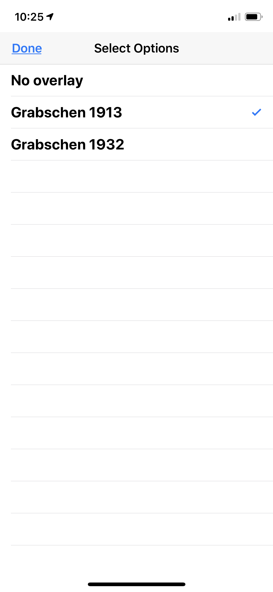
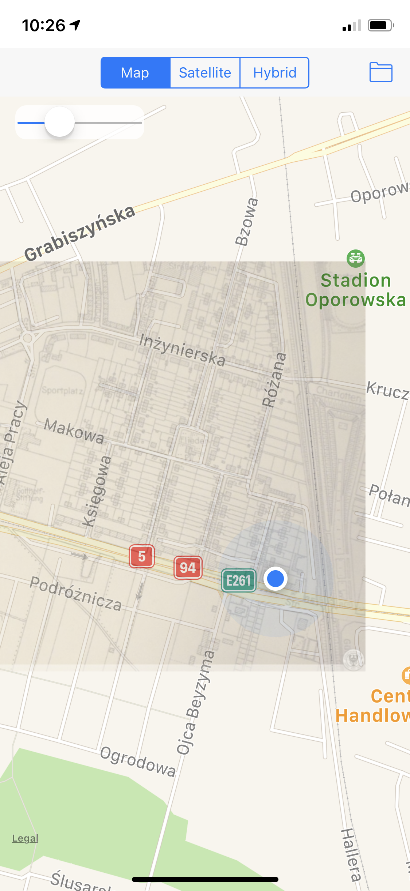

# Miscellaneous

## SF Symbol finder (MacOS)
Finds SF symbols related to the query and similar words

## Lotto Skaner (iOS)

Screens coming soon ...

UI: UIKit + SwiftUI views
- Scans Lotto tickets and tries to extract relevant data
- Keeps collection of scanned coupons
- Checks the winning numbers

Todo
- [ ] improve the UI
- [ ] move navigation out of SceneDelegate
- [ ] ... 

## Kiedy wywóz (iOS)
 
[www.kiedywywoz.pl](https://www.kiedywywoz.pl)

I tried to more or less copy the home screen, the list of waste collections and the side menu.  
Collection dates for the given address are generated programmatically. 
Obviously the original app can be improved in many ways. Just for the heck of it I added two screens - **'Bulky waste collections (Gabaryty)' map** and **'Problematic collections (Szops)' map**. JSON files were scrapped from the Ekosystem website.

## Overlays 🗺 ~2018 (iOS)

Slightly modified (for educational purposes) kodeco.com's "MapKit Tutorial: Overlay Views" (The first part)  
You can load custom overlay image and corresponding JSON file generated by Maptiler app.  
I added user's position tracking and slider to change opacity of the overlay.  
### Screenshots

