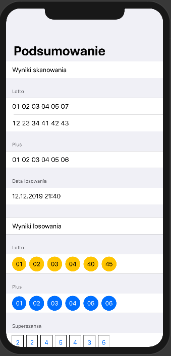

## Next Projects, Miscellaneous stuff

### LottoScan 🍀

Since there is no such app in the App Store I don't want to reveal the codebase just yet. The application is supposed to detect contents of Lotto and Mini Lotto lottery tickets, download draw results from Lotto server and calculate winnings. It utilizes ML Kit's Vision. As you can guess, extracting interesting fragments from detected text in this case is tricky. The worst part is detecting game type. I tried to train model with Create ML using prepared game logos (10 of each type) but I failed miserably. 

  
  

ResultsView composed using SwiftUI can look like this:  

#### Status

Suspended. I am noodling around with Apple's Vision and SwiftUI now. It works, but ML Kit's Vision is better and much more stable so extracting ticket contents is even more tricky.

### Overlays 🗺

Slightly modified (for educational purposes) raywenderlich.com's "MapKit Tutorial: Overlay Views" (first part)  
You can load custom overlay image and corresponding JSON file generated by Maptiler app.  
I added user's position tracking and slider to change opacity of the overlay.  

 

### Eyes To Words - Improve communication with people suffering from ALS 👀  

I wanted to develop an application that would convert the sequences of the eye movements into letters and then into words according to the system shown in this [video](https://www.youtube.com/watch?v=DL_ZMWru1lU)  
It turns out that the better solution would be to use Tobii Eye Tracker or Arduino / Raspberry Pi with respective sensors 

### Game of Dice - an Iphone version of the dice game from Kingdom Come Deliverance 🎲  

Currently I am getting familiar with [this](https://developer.apple.com/documentation/coreml/understanding_a_dice_roll_with_vision_and_object_detection) sample code and somehow trying to fit in one round game code   

### ...
